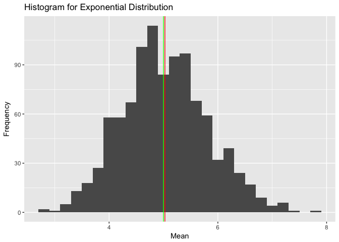
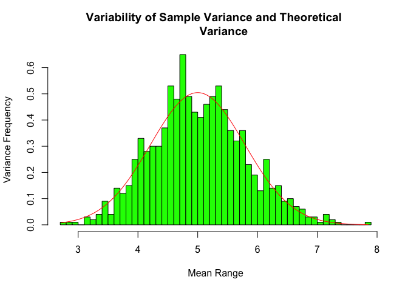
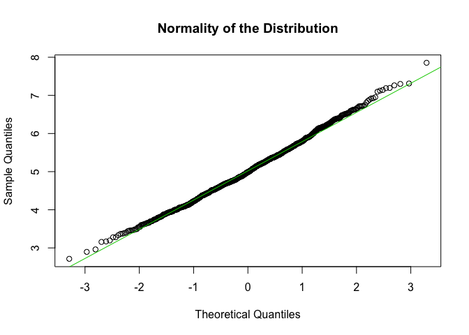

# Exponential Simulation Distribution

## Synopsis
This report investigates the averages of 40 exponentials, by running 1000 simulations and compares it with the Central Limit Theorem.  

```r
#install.packages("dplyr")
#install.packages("ggplot2")
library(dplyr, warn.conflicts = FALSE)
library(ggplot2)
# setting the seed for replication purposes
set.seed(28)
# averages of 40 exponentials
n = 40
# generating a thousand simulations
r = 1000
# setting lambda to 0.2 for all the simulations
lambda = 0.2
# standard deviation that is (1/lambda)/sqrt(n)
sd_lambda <- (1/lambda)/sqrt(n)
```
#### 1. Showing the sample mean and compare it to the theoretical mean of the distribution   
As we may observe from the below simulation, both the green and red vertical lines are near each others, further helping to show that the sample mean and theoretical mean are very close.  


```r
expo = NULL
for (i in 1:r) expo = c(expo, mean(rexp(n, lambda)))
mean_expo <- mean(expo)
expo2 <- data.frame(expo)
g <- qplot(expo2$expo, geom = "histogram", binwidth = .2, 
           main = "Histogram for Exponential Distribution", 
           xlab = "Mean", ylab = "Frequency")
g <- g + geom_vline(xintercept = 1/lambda, col = "green") +
    geom_vline(xintercept = mean_expo, col = "red")
g
```

<!-- -->
Below are the means for both of our distributions, of  theorectial and sample.    

```r
# theoretical mean
1/lambda
```

```
## [1] 5
```

```r
# the mean of our sample (of averages of 40 exponential)
mean_expo
```

```
## [1] 5.026378
```
#### 2. Showing how variable the sample is (via variance) and compare it to the theoretical variance of the distribution  

```r
x <- seq(min(expo), max(expo), length = 1000)
y <- dnorm(x, mean = 1/lambda, sd = (1/lambda/sqrt(n)))
hist(expo, prob = TRUE, breaks = n, col = "green",
     main = "Variability of Sample Variance and Theoretical 
     Variance", ylab = "Variance Frequency", xlab = "Mean Range")
lines(x, y, pch = 19, col = "red", lty = 13)
```

<!-- -->
  
#### 3. Showing that the distribution is approximately normal  
As we see in the below plot, the distribution is normal.

```r
qqnorm(expo, main = "Normality of the Distribution")
# qqline function to better estimate/display the parameters of the normal distribution
qqline(expo, col = 3)
```

<!-- -->
