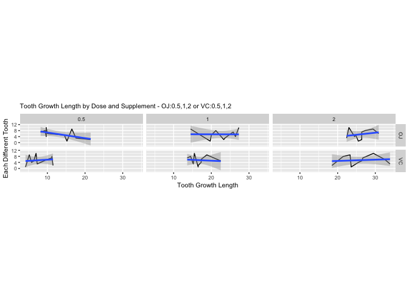
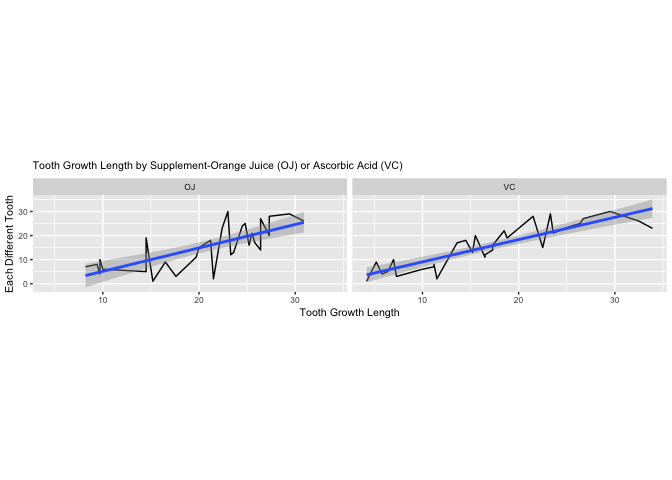
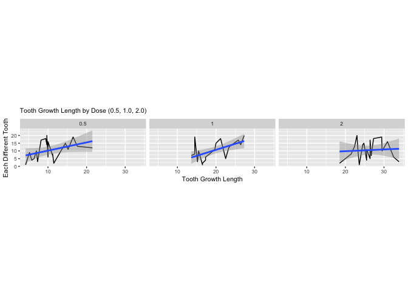

# ToothGrowth Data Analysis

## Synopsis
In this report, we are working with ToothGrowth dataset in R. Our main goal is to analyze/summarize the dataset, with intention of comparing the confidence interval of tooth growth by supp and dose, and provide conclusion of our new foundings.  

#### 1. Loading the ToothGrowth data and performing some basic exploratory data analyses

```r
# pander package for generating pdf file
#install.packages("pander")
#install.packages("dplyr")
#install.packages("ggplot2")
library(pander)
library(dplyr, warn.conflicts = FALSE)
library(ggplot2)
```
  
Below, we are creating three distinctive plots using dplyr and ggplot2 R packages:
  
* Following plot displays a six separated plots by the two variables of supp and three variables of dose. We have also passed a linear model (regression), with the purpose of showing the differences (regression line directions), for the same doses in each supp group (of VC and OJ)  

```r
head(ToothGrowth)
```

```
##    len supp dose
## 1  4.2   VC  0.5
## 2 11.5   VC  0.5
## 3  7.3   VC  0.5
## 4  5.8   VC  0.5
## 5  6.4   VC  0.5
## 6 10.0   VC  0.5
```

```r
# below, we are creating a new data frame and adding a id column to it (numbering each set of doses, with numbers from 1 to 10)
ToothGrowth_DOSE_ID <- as.data.frame(select(ToothGrowth, len, supp, dose) %>% mutate(id = rep(seq(1:10),6)))
# here, we are creating our plot
ggplot(ToothGrowth_DOSE_ID, aes(x = len, y = id)) + geom_line() + facet_grid(supp ~ dose) + geom_smooth(method = "lm")  + labs(x = "Tooth Growth Length", y = "Each Different Tooth", title = "Tooth Growth Length by Dose and Supplement - OJ:0.5,1,2 or VC:0.5,1,2")
```

<!-- -->
  
* Following plot displays a two separated plots by two variables of supp. Similar to the previous plot, we have also passed a linear model (regression), with the purpose of showing the differences (line direction), for each of the two supp (VC and OJ)  

```r
# below, we are creating a new data frame and adding "id" column to it (numbering each set by supp, with numbers from 1 to 30)
ToothGrowth_SUPP_ID <- as.data.frame(select(ToothGrowth, len, supp, dose) %>% mutate(id = rep(seq(1:30),2)))
# here, we are creating our plot
ggplot(ToothGrowth_SUPP_ID, aes(x = len, y = id)) + geom_line() + facet_grid(. ~ supp) + geom_smooth(method = "lm")  + labs(x = "Tooth Growth Length", y = "Each Different Tooth", title = "Tooth Growth Length by Supplement - Orange Juice (OJ) or Ascorbic Acid (VC)")
```

<!-- -->
  
* Following plot displays a three separated plots by three variables of dose. Similar to the previous plot, we have also passed a linear model (regression), with the purpose of showing the differences (line direction), for each of the three dose (0.5, 1.0, and 2.0)

```r
ToothGrowth_DOSE_ID_3 <- as.data.frame(select(ToothGrowth, len, supp, dose) %>% arrange(dose) %>% mutate(id = rep(seq(1:20),3)))
# here, we are creating our plot
ggplot(ToothGrowth_DOSE_ID_3, aes(x = len, y = id)) + geom_line() + facet_grid(. ~ dose) + geom_smooth(method = "lm") + labs(x = "Tooth Growth Length", y = "Each Different Tooth", title = "Tooth Growth Length by Dose (0.5, 1.0, 2.0)")
```

<!-- -->
  
#### 2. Providing a basic summary of the data 
  
Now, we are going to display more information about our ToothGrowth dataset, by using multiple R analysis functions, such as dim(), str(), head(), tail(), and dplyr(summarize).

```r
dim(ToothGrowth)
```

```
## [1] 60  3
```

```r
str(ToothGrowth)
```

```
## 'data.frame':	60 obs. of  3 variables:
##  $ len : num  4.2 11.5 7.3 5.8 6.4 10 11.2 11.2 5.2 7 ...
##  $ supp: Factor w/ 2 levels "OJ","VC": 2 2 2 2 2 2 2 2 2 2 ...
##  $ dose: num  0.5 0.5 0.5 0.5 0.5 0.5 0.5 0.5 0.5 0.5 ...
```

```r
head(ToothGrowth)
```

```
##    len supp dose
## 1  4.2   VC  0.5
## 2 11.5   VC  0.5
## 3  7.3   VC  0.5
## 4  5.8   VC  0.5
## 5  6.4   VC  0.5
## 6 10.0   VC  0.5
```

```r
tail(ToothGrowth)
```

```
##     len supp dose
## 55 24.8   OJ    2
## 56 30.9   OJ    2
## 57 26.4   OJ    2
## 58 27.3   OJ    2
## 59 29.4   OJ    2
## 60 23.0   OJ    2
```
  
Summary (two rows), grouped by supp, consists of mean, median, sd (standard deviation), variance, minimum value, and maximum value.  

```r
SUMMARY_SUPP <- as.data.frame(select(ToothGrowth_SUPP_ID, len, supp, dose, id) %>% group_by(supp) %>% summarise(mean = mean(len), median = median(len), sd = round(sd(len),2), variance = round(var(len),2), min = min(len), max = max(len)))
SUMMARY_SUPP
```

```
##   supp     mean median   sd variance min  max
## 1   OJ 20.66333   22.7 6.61    43.63 8.2 30.9
## 2   VC 16.96333   16.5 8.27    68.33 4.2 33.9
```
  
Summary (six rows), grouped by supp and then dose, consists of mean, median, sd (standard deviation), variance, minimum value, and maximum value.  

```r
SUMMARY_SUPP_DOSE <- as.data.frame(select(ToothGrowth_DOSE_ID, len, supp, dose, id) %>% group_by(supp, dose) %>% summarise(mean = mean(len), median = median(len), sd = round(sd(len),2), variance = round(var(len),2), min = min(len), max = max(len)))
SUMMARY_SUPP_DOSE
```

```
##   supp dose  mean median   sd variance  min  max
## 1   OJ  0.5 13.23  12.25 4.46    19.89  8.2 21.5
## 2   OJ  1.0 22.70  23.45 3.91    15.30 14.5 27.3
## 3   OJ  2.0 26.06  25.95 2.66     7.05 22.4 30.9
## 4   VC  0.5  7.98   7.15 2.75     7.54  4.2 11.5
## 5   VC  1.0 16.77  16.50 2.52     6.33 13.6 22.5
## 6   VC  2.0 26.14  25.95 4.80    23.02 18.5 33.9
```
  
#### 3. Using confidence intervals and/or hypothesis tests to compare tooth growth by supp and dose   


```r
# grouping all the Ascorbic Acid (VC) observations
supp1 <- head(ToothGrowth_SUPP_ID,30)
supp1 <- select(supp1,len)
# grouping all the orange juice (OJ) observations
supp2 <- tail(ToothGrowth_SUPP_ID,30)
supp2 <- select(supp2, len)
```
  
The confidence level for supp:  

```r
t.test(supp1,supp2)$conf.int
```

```
## [1] -7.5710156  0.1710156
## attr(,"conf.level")
## [1] 0.95
```
  


```r
# grouping all the dose levels of 0.5 (to dose1)
dose1 <- head(ToothGrowth_DOSE_ID_3, 20)
dose1 <- select(dose1, len)
# grouping all the dose levels of 1 (to dose2)
dose2 <- select(ToothGrowth_DOSE_ID_3, len, dose) %>% filter(dose == 1)
dose2 <- select(dose2, len)
# grouping all the dose levels of 2 (to dose3)
dose3 <- tail(ToothGrowth_DOSE_ID_3, 20)
dose3 <- select(dose3, len)
```
  
The confidence level for dose1 (0.5) and dose2 (1):  

```r
t.test(dose2, dose1)$conf.int
```

```
## [1]  6.276219 11.983781
## attr(,"conf.level")
## [1] 0.95
```
  
The confidence level for dose1 (0.5) and dose3 (2):  

```r
t.test(dose3, dose1)$conf.int
```

```
## [1] 12.83383 18.15617
## attr(,"conf.level")
## [1] 0.95
```
  
The confidence level for dose2 (1) and dose3 (2):  

```r
t.test(dose3, dose2)$conf.int
```

```
## [1] 3.733519 8.996481
## attr(,"conf.level")
## [1] 0.95
```


#### 4. Stating our conclusions and the assumptions needed for our conclusions  

Our conclusion is that, we're assuming for each of our four distinctive confidence intervals, there is a 95% probability that the calculated confidence interval from some future experiment sorounds the true population parameter. For instance, for the dose3 and dose2, the 95% confidence interval is between 3.73 and 8.99, since our data is random and the samples are independent of each others.
